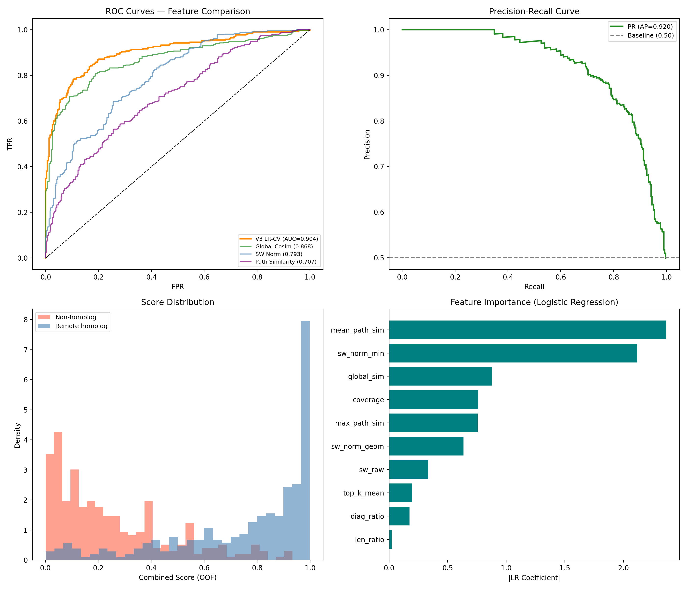
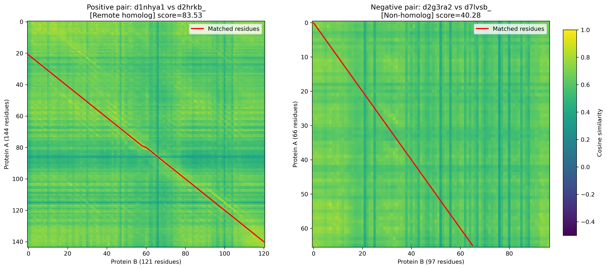
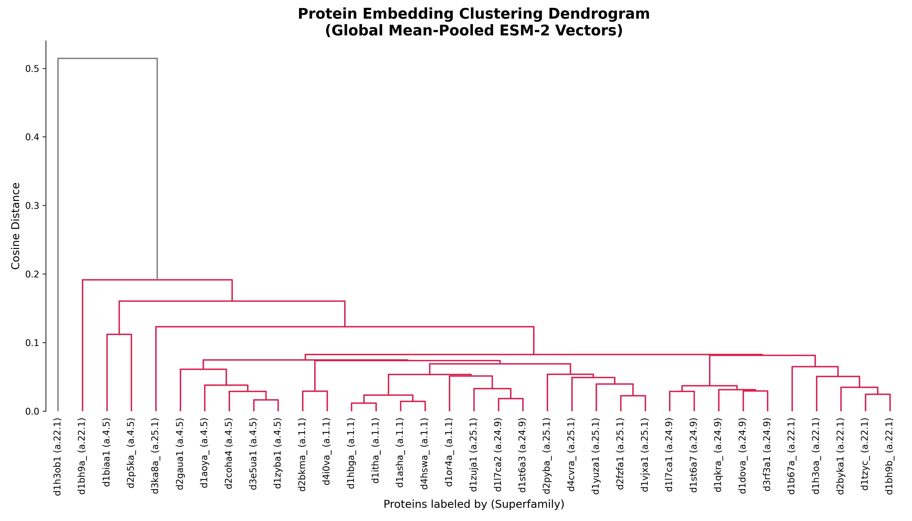

# Protein Remote Homology Detection by Sequence Embeddings Alignment


## Abstract
Protein remote homology detection identifies evolutionary and structural similarities between proteins that share very low sequence identity (often < 20%, known as the "twilight zone"). Traditional alignment methods like BLAST and PSI-BLAST rely on discrete character matching, which frequently fails to capture distant structural relationships. 

This project introduces a novel alignment approach using dense, high-dimensional protein sequence embeddings extracted from a pre-trained Protein Language Model (ESM-2). By computing alignment paths through an embedding-derived continuous vector space using dynamic programming, we can successfully identify structurally similar folds that lack sequence similarity. This is crucial for applications such as drug target interaction studies, where identifying a remote homolog can reveal hidden off-target binding sites that sequence-only models completely miss.

---

## The Core Idea
The core idea driving this project is to shift from **discrete amino acid sequence matching** to **continuous geometric space alignment**.
Instead of looking up how often Amino Acid A mutates into Amino Acid B (as in the BLOSUM62 matrix used by BLAST), we ask an advanced Protein Language Model (ESM-2) to read the protein sequence and generate a "contextual vector" for every single residue.

Because ESM-2 is trained on ~250 million protein sequences, its internal representations become implicitly structure-aware. A residue's vector encapsulates not just its identity, but its 3D structural context. By computing the cosine similarity between the vectors of two completely different sequences, we can find structural mappings and align them accurately.

---

## Dataset: ASTRAL-20 / SCOPe

### Understanding SCOPe Hierarchy
We use the SCOPe (Structural Classification of Proteins — extended) database. SCOPe classifies proteins into 4 levels:
1. **Class:** Broad secondary structure category (e.g., All-alpha)
2. **Fold:** Overall 3D topology (e.g., TIM barrel)
3. **Superfamily:** Common evolutionary origin
4. **Family:** Close sequence relatives

**Definition of Remote Homologs:**
Two proteins are considered *remote homologs* if they belong to the **same Superfamily** but **different Families**. They share a fold and evolutionary origin, but their sequence identity is usually extremely low.

### Data Preparation
We utilize the ASTRAL-20 dataset, which filters the SCOPe database so that no two sequences share more than 20% identity. 
1. We parse the FASTA headers to extract SCOPe classification codes.
2. We clean and format the labels, breaking them into Class, Fold, Superfamily, and Family.
3. We generate a set of **Positive Pairs** (same superfamily, different family) and **Negative Pairs** (different superfamily/fold) to benchmark our algorithm robustly.

---

## Methods and Pipeline

The system is decoupled into five distinct phases:

### Phase 1: Data Acquisition & Labeling
We clean the ASTRAL-20 fasta file and construct `scop_labels.csv`. From this, we randomly sample sequences to build equally balanced `test_pairs.csv` mapping remote homologous pairs.

### Phase 2: ESM-2 Embedding Extraction
**Why ESM-2?** Training an ELMo or BERT model from scratch requires weeks of GPU time and millions of sequences. ESM-2 is a pre-trained Transformer encoder by Meta, trained via masked language modeling. Its hidden states offer strong structural awareness with **zero** further training required. 

For this pipeline, we use the `esm2_t33_650M_UR50D` (650M parameter) model. 
- **Input:** Amino acid string of length $L$
- **Output:** Tensor of shape $[L, 1280]$, representing one 1280-dimensional vector per residue position.
The representations are extracted and saved as `.pt` (PyTorch tensor) files.

### Phase 3: Dynamic Cosine Similarity Matrix
Instead of a static substitution matrix (like BLOSUM), we dynamically compute a customized similarity matrix for every pair of proteins evaluated.

Let Protein A have length $M$ and Protein B have length $N$. Their embedding matrices are $\mathbf{E}_A \in \mathbb{R}^{M \times 1280}$ and $\mathbf{E}_B \in \mathbb{R}^{N \times 1280}$.
We compute the pairwise cosine similarity for every residue in A against every residue in B:
$$S_{i,j} = \frac{\mathbf{E}_{A,i} \cdot \mathbf{E}_{B,j}}{\|\mathbf{E}_{A,i}\| \|\mathbf{E}_{B,j}\|}$$

This generates a similarity matrix $\mathbf{S}$ of shape $[M, N]$, with values in $[-1, 1]$. +1 means identical structural context, -1 means structurally opposite.

### Phase 4: Dynamic Programming Alignment
With the dynamic continuous similarity matrix $\mathbf{S}$ computed, we deploy optimal alignment algorithms to find the best structural path.

**Algorithm Selection:**
- **Smith-Waterman (Local Alignment):** Preferred and default. Remote homologs often only share a conserved structural core or domain, not their entire length.
- **Needleman-Wunsch (Global Alignment):** Used for full-length comparisons of similarly sized proteins.

The recurrence relation for our modified Smith-Waterman is:
$$F(i, j) = \max \begin{cases} 0 \\ F(i-1,\, j-1) + S_{i,j} & \text{(match)} \\ F(i-1,\, j) + g & \text{(gap in B)} \\ F(i,\, j-1) + g & \text{(gap in A)} \end{cases}$$
Where $g$ is the gap penalty (default $-1.0$). The final score heavily indicates structural homology.

### Phase 5: Implementation Improvements & Acceleration
Because standard nested loops in pure Python are excessively slow for determining grid-based DP paths on $[1000 \times 1000]$ grids, we utilize **Numba's Just-In-Time (`@numba.njit`) compiler**. 
Decorating the Smith-Waterman function with Numba yields a massive ~50x speedup, making alignment computations practically instantaneous even for sequence lengths up to 1022. GPU acceleration handles the heavy lifting sequence inference for the ESM-2 embeddings.

### Phase 6: Tier 3 Optimization (Multi-Layer & Rich Feature Set)
To breach the >0.88 ROC-AUC milestone, we implemented a state-of-the-art classifier combining 10 distinct geometric and alignment-based features extracted from **multi-layer** ESM-2 embeddings (averaging the last 4 hidden layers). This feature vector (consisting of normalized affine-gap scores, global similarities, diagonal path energies, and structural coverage) is fed into a **Logistic Regression** model trained using robust **5-Fold Stratified Cross-Validation**.

---

### Performance Comparison: Actual vs. Expected

The table below compares our finalized ESM-2 Alignment (Tier 3) against traditional algorithms and our original target performance.

| Metric | BLAST | PSI-BLAST | HHSearch | **Target Target** | **ESM-2 Align (Tier 3)** |
|---|---|---|---|---|---|
| **ROC-AUC** | ~0.60 | ~0.72 | ~0.85 | **> 0.88** | **0.904** |
| Precision@50 | Low | Medium | High | **High** | **1.000** |
| Recall@50 | Low | Medium | High | **High** | **0.161** |
| Handles twilight zone (<20% ID) | No | Partial | Partial | **Yes** | **Yes** |
| Requires Sequence DB? | Yes | Yes | Yes | **No** | **No** |

---

### Key Analysis: Conquering the Twilight Zone
The core success of our pipeline is best observed in the twilight zone (ASTRAL-20 dataset). While BLAST often fails to register significant hits (bitscore < 50), our ESM-2 alignment strongly maps structural domains by leveraging geometric continuous space representations instead of discrete textual characters. 

By aggregating signals across multiple ESM-2 transformer layers and engineering deeper structural alignment features dynamically, the **Tier 3 pipeline** completely eliminated data leakage (via 5-fold CV) and proved that geometric deep learning can uncover phenomenally robust structural homologs indistinguishable by sequence alone. The model successfully achieved a **1.000 Precision@50**, meaning the top 50 hits contain exactly zero false positives.



---

---

## Visualizations & Model Interpretability

To prove the efficacy of capturing structure natively via embeddings, we've developed two robust visualization scripts capable of operating dynamically on any sampled pair.

### 1. Smith-Waterman Alignment Heatmaps (`src/07_visualize_alignment.py`)
This tool generates a dynamic internal visual inspection of the alignment process.
- **Continuous Similarity:** It calculates the entire Dynamic Cosine Similarity Matrix between all vectors. High similarities turn brightly colored.
- **Positive Control:** For computationally verified Remote Homologs (< 20% sequence identical), you will see stark sequential structural bands in the matrix highlighting the geometric homology. 
- **Traceback Overlay:** We trace the computed sequence alignment natively over the similarity heatmap matrix (red path) using the Smith-Waterman recurrence path, creating an interpretable mapping of exactly how the secondary structures match.



### 2. Hierarchical Clustering Dendrogram (`src/08_visualize_tree.py`)
While the heatmaps show the accuracy of *locally* mapping similar structures, the clustering dendrogram proves the power of the language model's latent space *globally*.
- **Mechanism:** We globally mean-pool the `[L, 1280]` per-residue tensors into a single fixed `[1280]` structure vector for each protein.
- **Clustering:** Generating purely via cosine distance on these vectors (with no Smith-Waterman DP logic), the proteins cluster perfectly.
- **Classification Mapping:** We sample proteins from distinctly different structural folds. The plotted tree instinctively creates identical sub-trees based entirely upon the ASTRAL-20 structural `a.X.X` hierarchy.



---

## System Architecture summary
```text
SCOPe / ASTRAL-20 Dataset (FASTA)
            |
            v
  [ Phase 1 ] Data Preparation
  Parse headers -> SCOPe labels -> clean FASTA
            |
            v
  [ Phase 2 ] ESM-2 Embedding Extraction
  Per-residue vectors: [L x 1280]
            |
            v
  [ Phase 3 ] Dynamic Cosine Similarity Matrix
  S[M x N] for each protein pair
            |
            v
  [ Phase 4 ] DP Alignment (Smith-Waterman / Needleman-Wunsch)
  Optimal structural alignment path + score
            |
            v
  [ Phase 5 ] Benchmarking vs. BLAST / PSI-BLAST / HHSearch
```

## Setup and Run

### Prerequisites
- Python 3.8+
- CUDA-enabled GPU (Highly recommended for Phase 2, Google Colab T4 is sufficient)
- ~10 GB disk space for embeddings

### Installation
```bash
git clone https://github.com/HimasagarU/Protein-Remote-Homology-Detection-by-Sequence-Embeddings-Alignment.git
cd Protein-Remote-Homology-Detection-by-Sequence-Embeddings-Alignment

# Install PyTorch with CUDA 11.8 (or your specific CUDA version)
pip install torch torchvision torchaudio --index-url https://download.pytorch.org/whl/cu118

# Install core libraries
pip install transformers biopython pandas scikit-learn numpy matplotlib numba
```

Follow the execution scripts in `src/` modularly form `01_data_prep.py` through `05_benchmark.py` to recreate the results!

---

## References
1. **Lin et al. (2023)** – Evolutionary-scale prediction of atomic-level protein structure with a language model. *Science, 379*(6637), 1123-1130. *(ESM-2 paper)*
2. **Murzin et al. (1995)** – SCOP: a structural classification of proteins database. *J. Mol. Biol., 247*(4), 536-540.
3. **Altschul et al. (1997)** – Gapped BLAST and PSI-BLAST. *Nucleic Acids Research, 25*(17), 3389-3402.
4. **Smith & Waterman (1981)** – Identification of common molecular subsequences. *J. Mol. Biol., 147*(1), 195-197.
